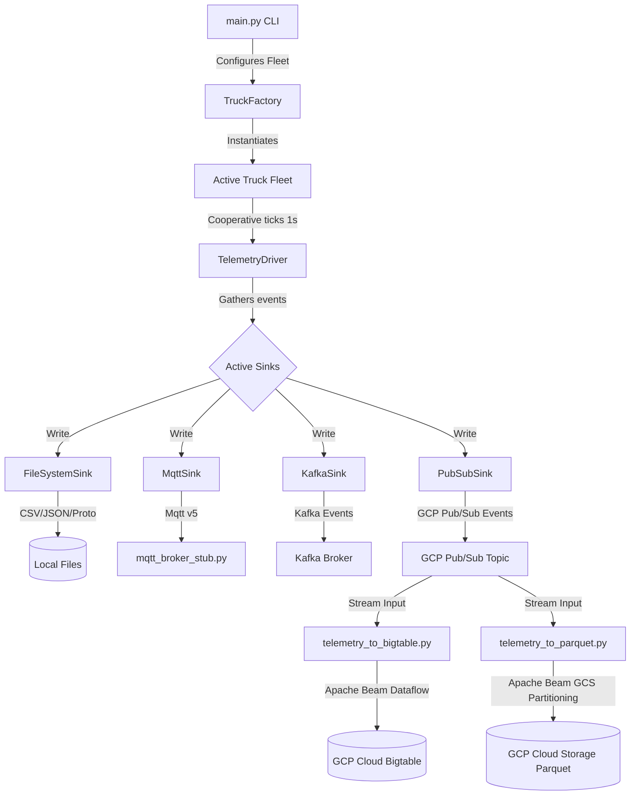

# 🚛 TTGenerator: Realistic Truck Telemetry Simulator

TTGenerator is a high-performance, cooperative asynchronous Python utility designed to simulate real-time fleet movement and telematics. It generates comprehensive, SAE J1939-compliant telemetry snapshots and streams them concurrently to file systems, message brokers, and Google Cloud pipelines.

---

## 📐 System Architecture & Data Flow

Below is the end-to-end telemetry pipeline, from the real-time simulation engine down to downstream Bigtable and GCS Parquet storage:



---

## 🌟 Core Features

- **Cooperative Asynchronous Multi-threading:** Powered by `asyncio`, simulating thousands of vehicles ticking at precise 1-second intervals.
- **Physical Vehicle Modeling:** Fully simulates throttle percentage, engine RPM, coolant/oil temperatures, transmission gear shifting, and fluid dynamics.
- **Realistic Route Progression:** Calculates geodetic compass bearings and travels along Great-Circle routes using the **Haversine formula**.
- **Flexible Behavior Presets:**
  - `Standard`: Routine operations with steady acceleration and a conservative 50 kph top speed.
  - `Fast`: High-speed transport profile with aggressive acceleration and a 100 kph top speed.
  - `Faulty`: Low-velocity (30 kph) simulation featuring mid-trip engine breakdowns and intermittent 100-200km GPS drift anomalies.
  - `Empty`: Light-weight transit profile with very rapid acceleration (15s to top speed) reaching 100 kph.
  - `Loaded`: Heavy-haul simulation with slow, mass-weighted acceleration (90s to top speed) capped at 50 kph.
- **Pluggable Architecture:** Support for multiple formats (CSV, JSON, Protobuf) and stream targets (MQTT, Apache Kafka, Google Cloud Pub/Sub, File System).

---

## 🛠️ Quick Start

### 1. Prerequisites
Ensure you have **Python 3.8+** installed on your system.

### 2. Installation
Clone the repository and navigate to the project directory:
```bash
git clone <your-repository-url>
cd TTGenerator
```

Create a virtual environment and install the required dependencies:
```bash
# Create virtual environment
python3 -m venv .venv

# Activate virtual environment
source .venv/bin/python    # On Linux/macOS
# or: .venv\Scripts\activate  # On Windows

# Install required packages
pip install -r requirements.txt
```

### 3. Run a Basic Simulation
Launch a quick 2-truck, 10-second simulation writing CSV outputs locally:
```bash
python main.py --count 2 --duration 10 --file telemetry_run.csv --file-format csv
```

---

## ☁️ GCP Pub/Sub Integration & Authentication Setup

To use the **Google Cloud Pub/Sub Sink**, you must have a GCP Project and a target Pub/Sub topic created and ready.

> [!IMPORTANT]
> **Prerequisites for Pub/Sub and Apache Beam Sinks:**
> 1. A Google Cloud Platform (GCP) project.
> 2. A Pub/Sub Topic (e.g. `telemetry-raw`).
> 3. Google Cloud SDK (`gcloud`) installed locally.

### Step 1: Install & Set Up the Google Cloud CLI
To authenticate with Google Cloud, you need the `gcloud` command-line tool.
* Detailed Installation Guide: [Google Cloud SDK Installation](https://cloud.google.com/sdk/docs/install)

Once installed, initialize your configuration and set your active project:
```bash
gcloud init
gcloud config set project <YOUR_GCP_PROJECT_ID>
```

### Step 2: Set Up Application Default Credentials (ADC)
This utility uses the official Google Cloud Python SDK which searches for credentials automatically via **Application Default Credentials**. 

Authenticate your local machine to use your user credentials for API calls:
```bash
gcloud auth application-default login
```
This command launches a browser window to authenticate with your GCP account and creates a local credential JSON file that the SDK automatically detects.

---

## 📋 CLI Parameters Reference

The primary driver is configured entirely through command-line arguments on `main.py`:

| Parameter | Type | Default | Description |
| :--- | :---: | :---: | :--- |
| `--count` | `int` | `10` | Number of active trucks to simulate in the fleet. |
| `--customer` | `str` | `CUST001` | Comma-separated customer IDs (assigns VINs round-robin). |
| `--prefix` | `str` | `V` | Prefix of the generated 17-character VIN. |
| `--duration` | `int` | `None` | Max duration (seconds) before starting a graceful shutdown. |
| `--file` | `str` | `None` | Output file path to write results locally. |
| `--file-format` | `str` | `csv` | Format for local file sink (`csv`, `json`, `proto`). |
| `--pubsub-project` | `str` | `None` | Target GCP Project ID for the Pub/Sub Sink. |
| `--pubsub-topic` | `str` | `None` | Target GCP Topic ID for the Pub/Sub Sink. |
| `--pubsub-format` | `str` | `proto` | Payload format for Pub/Sub (`csv`, `json`, `proto`). |
| `--pubsub-metadata` | `list` | `customer_id` | Payload fields to include as PubSub message attributes. |
| `--kafka-bootstrap-servers` | `str` | `None` | Kafka bootstrap servers (e.g., localhost:9092). |
| `--kafka-topic` | `str` | `None` | Kafka topic ID. |
| `--kafka-format` | `str` | `json` | Payload format for Kafka (`csv`, `json`, `proto`). |
| `--kafka-metadata` | `list` | `customer_id` | Payload fields to include as Kafka message headers. |
| `--mqtt-host` | `str` | `None` | MQTT broker host address. |
| `--mqtt-port` | `int` | `1883` | MQTT broker connection port. |
| `--mqtt-topic` | `str` | `None` | MQTT target topic name. |
| `--mqtt-format` | `str` | `json` | Payload format for MQTT (`csv`, `json`, `proto`). |
| `--mqtt-metadata` | `list` | `customer_id` | Payload fields to include as MQTT v5 User Properties. |
| `--behavior-dist` | `list` | `40 15 15 15 15` | Percentage distribution of presets (Standard, Fast, Faulty, Empty, Loaded). |
| `--start-time` | `str` | `Current UTC` | ISO 8601 string representing base clock starting timestamp. |

---

## 🚀 Example Usage Scenarios

### 1. Local Data Generation (CSV)
Generate a 1-minute simulation for 5 trucks and save the results to a local CSV file:
```bash
python main.py --count 5 --duration 60 --file telemetry.csv --file-format csv
```

### 2. Real-time Cloud Streaming (JSON to Pub/Sub)
Stream real-time JSON telemetry from 100 trucks directly to a Google Cloud Pub/Sub topic:
```bash
python main.py --count 100 --pubsub-project <PROJECT_ID> --pubsub-topic telemetry-raw --pubsub-format json
```

### 3. MQTT Stream (Protobuf)
Simulate a fleet streaming compact Protobuf binary data to a local MQTT broker:
```bash
python main.py --count 10 --mqtt-host localhost --mqtt-topic trucks/proto --mqtt-format proto
```

### 4. Historical Backfill Simulation
Simulate a 1-hour "historical" journey starting from a specific date in the past, saving to a JSON file:
```bash
python main.py --count 2 --start-time 2026-05-01T00:00:00Z --duration 3600 --file backfill.json --file-format json
```

---

## 🔌 Running Auxiliary Components


### 1. Local MQTT v5 Broker Stub
For rapid testing of the MQTT sink without spinning up an enterprise Mosquitto broker, utilize the built-in, lightweight async MQTT v5 server stub:

```bash
# Start the broker stub (listens on 0.0.0.0:1883 by default)
python mqtt_broker_stub.py
```

Now, in a separate terminal, launch the simulator sending MQTT data locally:
```bash
python main.py --count 5 --mqtt-host localhost --mqtt-topic telemetry/trucks --mqtt-format json
```
Check `mqtt_stub.log` to watch incoming TCP publish packets.

### 2. Generate Lookup Master Data
Generate synthetic relational CSVs (customers, subscription tiers, vehicle metadata) to seed lookups in BigQuery:

```bash
python generate_master_data.py
```
Outputs `customer_master.csv`, `subscription_master.csv`, and `vehicle_master.csv`.

---

## ⚡ Running downstream Apache Beam Pipelines (Dataflow)

This utility includes two production-grade Apache Beam streaming pipelines in the root directory for ingestion.

> [!TIP]
> Make sure to install the supplementary requirements for Apache Beam before running these:
> ```bash
> pip install -r requirements.txt
> pip install -r parquet_requirements.txt
> ```

### A. Telemetry to Bigtable Streaming (`telemetry_to_bigtable.py`)
Reads telematics from Pub/Sub, parses column families (`gps`, `imu`, `vehicle`, `device`), and writes them to Google Cloud Bigtable.

```bash
python telemetry_to_bigtable.py \
  --input_subscription projects/<PROJECT>/subscriptions/<SUB_NAME> \
  --project_id <PROJECT_ID> \
  --instance_id <BIGTABLE_INSTANCE_ID> \
  --table_id <BIGTABLE_TABLE_ID> \
  --runner DirectRunner   # Use DirectRunner for local testing, or DataflowRunner for GCP
```

### B. Telemetry to Parquet GCS Archival (`telemetry_to_parquet.py`)
Reads telematics from Pub/Sub, dynamically windows messages, and writes Hive-partitioned Parquet files directly to Cloud Storage (`date=YYYY-MM-DD/vin=VXXXXXX/`).

```bash
python telemetry_to_parquet.py \
  --input_subscription projects/<PROJECT>/subscriptions/<SUB_NAME> \
  --output_path gs://<YOUR_BUCKET_NAME>/raw-telemetry/ \
  --project_id <PROJECT_ID> \
  --window_size 300 \
  --runner DirectRunner
```

---

## 🧬 Compiling the Telemetry Protocol Buffer

The simulator uses Google Protocol Buffers for fast, compact binary wire-transfers. If you edit the telematics schema defined in `src/models/telemetry.proto`, you must compile it to Python:

```bash
python -m grpc_tools.protoc \
  -I=src/models/ \
  --python_out=src/models/ \
  src/models/telemetry.proto
```
This updates the compiled classes in `src/models/telemetry_pb2.py`.

---

## 📊 Telemetry Attributes Reference

The simulator generates a comprehensive set of signals for each telemetry snapshot:

### Core Identifiers
| Attribute | Type | Description |
| :--- | :---: | :--- |
| `event_ts` | `str` | ISO 8601 timestamp of the event. |
| `customer_id` | `str` | Unique identifier for the customer. |
| `vehicle_id` | `str` | Unique Vehicle Identification Number (VIN). |
| `device_id` | `str` | Unique identifier for the telematics device. |

### GPS Signals
| Attribute | Type | Description |
| :--- | :---: | :--- |
| `latitude` | `float` | GPS Latitude in decimal degrees. |
| `longitude` | `float` | GPS Longitude in decimal degrees. |
| `altitude_m` | `float` | GPS Altitude in meters. |
| `gps_speed_kph` | `float` | Vehicle speed derived from GPS (kph). |
| `heading_deg` | `float` | Compass heading/bearing (0-359 degrees). |
| `hdop` | `float` | Horizontal Dilution of Precision (GPS accuracy). |
| `satellite_count` | `int` | Number of GPS satellites in view. |

### Vehicle Bus (J1939) Signals
| Attribute | Type | Description |
| :--- | :---: | :--- |
| `vehicle_speed_kph` | `float` | Speed reported by the vehicle's wheel sensors (kph). |
| `engine_rpm` | `float` | Engine revolutions per minute. |
| `accelerator_pedal_pct` | `float` | Throttle position percentage (0-100%). |
| `engine_load_pct` | `float` | Current engine load as a percentage. |
| `fuel_rate_lph` | `float` | Instantaneous fuel consumption (liters per hour). |
| `total_fuel_used_l` | `float` | Cumulative fuel consumed during the trip. |
| `fuel_level_pct` | `float` | Fuel tank level percentage (0-100%). |
| `coolant_temp_c` | `float` | Engine coolant temperature in Celsius. |
| `oil_temp_c` | `float` | Engine oil temperature in Celsius. |
| `battery_voltage_v` | `float` | Vehicle battery voltage. |
| `engine_hours` | `float` | Cumulative engine run time in hours. |
| `odometer_km` | `int` | Cumulative distance traveled in kilometers. |
| `gear_selected` | `int` | Current transmission gear. |
| `ignition_status` | `int` | Ignition state (1: On, 0: Off). |

### Device & Health Signals
| Attribute | Type | Description |
| :--- | :---: | :--- |
| `device_temp_c` | `float` | Internal temperature of the telematics hardware. |
| `gsm_signal_dbm` | `int` | Cellular signal strength in dBm. |
| `can_bus_health` | `int` | Diagnostic bit for vehicle bus connectivity. |
| `tamper_alert` | `int` | Boolean flag for device tampering detection. |
